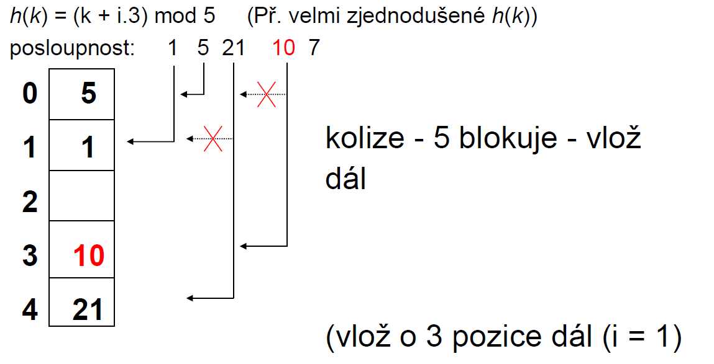

# 25. Zřetězené hashování, otevřené hashování, linear probing, double hashing - principy, výhody/nevýhody atd.

Některé způsoby jak redukovat kolize

## Zřetězené hašování

- Adresy v hašovací tabulce obsahují lineární seznamy
- V případě kolize (stejná adresa) se prvek vloží na konec seznamu
- V případě hledání sekvenčně procházíme konkrétní seznam
- Příklad:
  - h(k) = k%3
  - Posloupnost: 1, 5, 21, 10, 7


## Otevřené hašování

- Open adress hashing
- Tabulka adres uložená do pole
- V případě kolize prohledáváme určitpou metodou další prvky pole, dokud nenajdeme prázdnou pozici
- Při vyhledávání postupujeme stejně - stejnou metodou procházíme, pokud najdeme volnou pozici znamená to že prvek není indexován
- Podle metody hledání rozlišujeme:
  1. Lineární prohledávání (linear probing)
  2. dvojí hašování (double hashing)

### Linear Probing - Hledání volné pozice

- určení, zda pozice v tabulce obsahuje klíč shodný s hledaným klíčem
- Možnosti:
  - search hit = klíč nalezen
  - search miss = pozice prázdná, klíč nenalezen
  - jinak = na pozici je jiný klíč, hledej dál

### Dvojité hašování

- Double hashing
- Na rozdíl od lineárního prohledávání zde jako metodu použijeme **druhou** hašovací funkci
- Obě jsou funkcí k
- Každá má jinou sekvenci prohledávání
  ```
  h(k) = [h1(k) + i×h2(k)]%m
  ```
- h1(k) = k%m
- h2(k) = 1 + (k%m')
- m = prvočíslo nebo m= mocnina 2
- m' = číslo < m nebo liché číslo
- pokud d = největší společný dělitel => prohledáváme pouze 1/d pozic

### Příklad:


#### Při použití Linear probingu


#### Při použití Double hashingu





