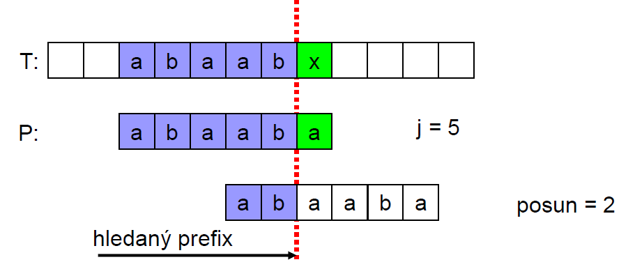
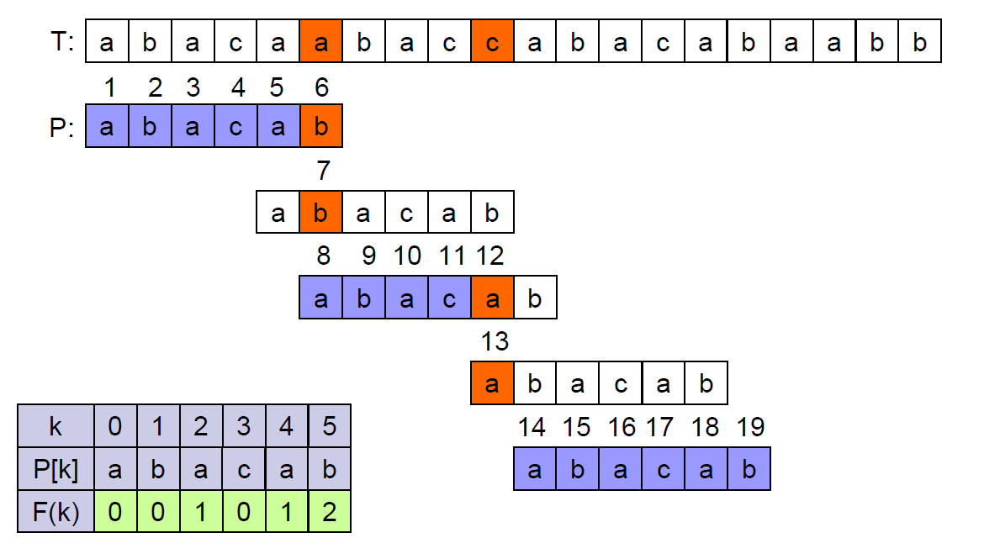

# 26. Prohledávání řetězců - terminologie, princip, přirozené prohledávání, KMP, chybová funkce

## Terminologie

- Řetězec _S_ o velikosti _m_
- Podřetěz S[i:j] je část řetězce _S_ mezi indexy _i_ a _j_
- Prefix (předpona) _S_ je podřetěz S[0:i]
- Suffix (přípona) _S_ je podřetěz S[i:m-1]
  - Kde i je libovolný index mezi 0 a m-1
- Každé slovo je prefixem i suffixem sebe sama
  - Jedná se o nevlastní (prefix/suffix)
- Abeceda A je konečná množina znaků ze kterých tvoříme řetězce _T_ a _P_
- Abeceda je během algoritmu konstantní

## Princip prohledávání řetězců

- Postupně procházíme celý řetězec _T_ a pro každou pozici testujeme, zda na ní nezačíná hledaný řetězec _P_
  - _P_ se posouvá po 1 znaku přes _T_
- Složitost algoritmu je **_O_**(m×n)
- V praxi obvykle dosahujeme **_O_**(m+n)
- Algoritmus je rychlý, pokud je abeceda "velká"
  - např.: A...Z, a...z, 1...9, atd
- Algoritmus je pomalý pro "malou" abecedu
  - Hlavne 0,1 (binární soubory, obrázkové soubory, atd)

## Algoritmus KMP

- Knuth-Morris-Pratt (KMP)
- Princip je stejný jako u přirozeného prohledávání
- Řízení procesu:
  - Nastupuje pokud se vyskytne neshoda mezi textem a vzorem v pozici P[j]
- Hledaný největší možný posun je roven délce největšího prefixu P[0:j-1], který je suffixem P[1:j-1]
- Příklad:
  
- Nalezneme největší prefix (start): "**a b** a a b" ( P[0:j-1])
- a suffix (end): "b a **a b**" (P[1:j-1])
- Hledaný řetězec: "a b"
- Nastavíme j = 2
- Označme _k_ jako pozici před neshodou

### KMP - příklad

## Chybová funkce (Failure function)

- F(k) je definována jako nejdelší prefix P[0:k], který je zároveň suffixem P[1:k]
