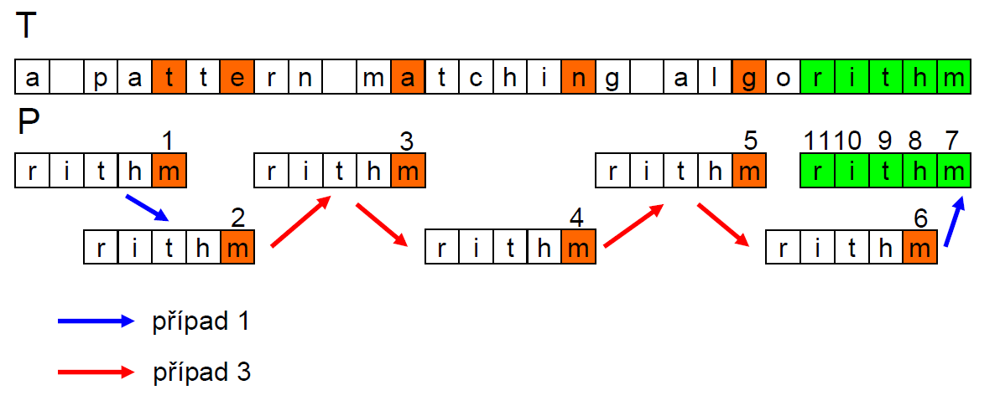

# 27. Prohledávání řetězců - Boyer-Moore, Rabin-Karp - princip, srovnání

## Boyer-Moore algoritmus

- Základní myšlenka - hledáme zrcadlově
- Začínáme na konci _P_ a postupujeme k začátku _T_
- V okamžiku neshody můžeme přeskočit celé skupiny znaků, ktereé se neshodují
- Existují 3 situace ve kterých se v okamžiku neshody (P[j] != T[i]) nachází vzor
  1. Pokud P obsahuje x, pak zkusíme posunout P doprava tak, aby se poslední výskyt x dostal proti x obsaženému v T[i]
  2. P obsahuje x, ale posun doprava na poslední výskyt x není možný, pak posuneme P doprava o 1 znak k T[i+1]
  3. Pokud P neobsahuje x, posuneme P tak aby bylo P[0] zarovnáno s T[i+1]
     1. Nejlepší případ - skok o celý vzor

## Robin-Karp algoritmus

- Založen na použití hašování
- Vypočteme hash pro vzor _P_ (délky m) a pro každý podřetězec řetězce _T_ délky m
- Procházíme řetězcem _T_ ale místo jednotlivých znaků porovnáváme hash každého podřetězce a vzoru
- V případě shody provedeme test podřetězce a vzoru znak po znaku - ochrana proti kolizi haše
- Podřetězec se posouvá po znaku => části podřetězců jsou shodné

## Porovnání

- BM je v porovnávání nad stejnou množinou dat rychlejší
- RK lze snadno, narozdíl od BM, rozšířit na vyhledávání více vzorů najednou
